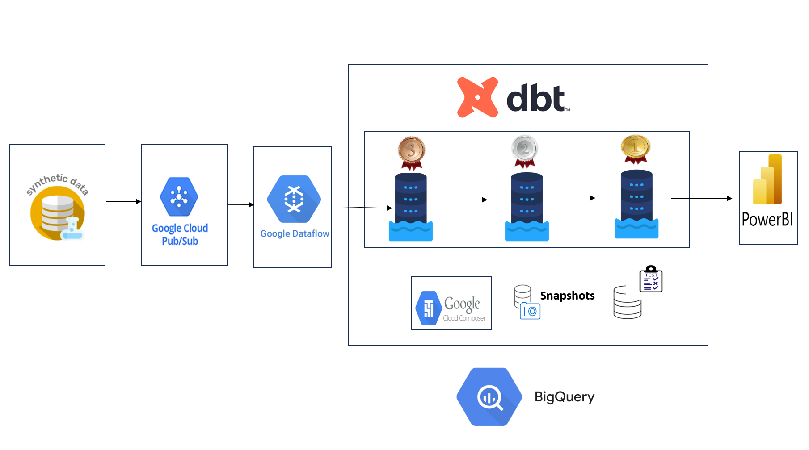
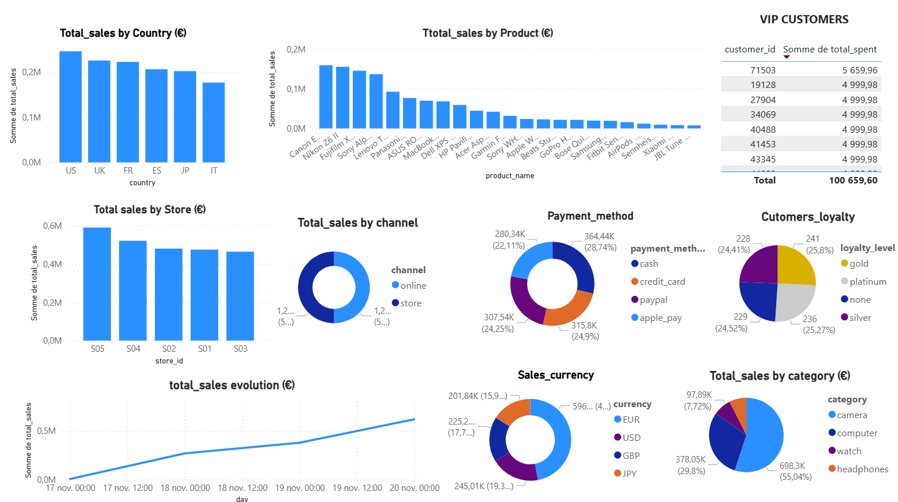

                           🛒 Sales Analytics - Modern Data Pipeline

📌 Présentation du projet

Ce projet illustre une pipeline de données streaming moderne appliquée à l'analyse des ventes e-commerce.

Il simule des événements de vente en temps réel (produits électroniques, clients,  achats multi-devises), ingère les données via Pub/Sub avec Dataflow dans BigQuery, les transformes selon une architecture Medallion (Bronze → Silver → Gold) avec BDT — en suivant les bonnes pratiques du Modern Data Stack.

👉 En résumé, c'est un écosystème complet d'analyse de ventes   construit sur Google Cloud Platform.

🏗️ Architecture

Flux de la pipeline :

Générateur de données → Simule des événements de vente en   (produits, clients,  achats ...) via Faker
Google Cloud Pub/Sub → Ingestion streaming des événements de vente

Google Dataflow → Pipeline Apache Beam pour l'ingestion de pub/sub à BigQuery (Bronze) 

BigQuery (Bronze) → Stockage brut des événements (sales_bronze.sales_events)

dbt (Silver/Gold) → Transformations, agrégations et création de marts analytics

Cloud Composer (Airflow) → Orchestration des transformations dbt snapshots et tests

Power BI → Dashboards analytics

Cloud Storage → Buckets pour staging et fichiers temporaires

📊 Livrables finaux

✅ Pipeline streaming complet de Pub/Sub → Dataflow → BigQuery

✅ Architecture Medallion (Bronze/Silver/Gold)

✅ Modèles dbt pour transformations et agrégations

✅ Snapshots pour historisation des données (SCD Type-2)

✅ Dashboard Power BI

Métriques disponibles :

📈 Ventes totales par pays, produit, magasin, catégorie

💰 Évolution des revenus

🌍 Répartition devises

🛍️ Analyse des canaux de vente

💳 Méthodes de paiement préférées

👥 Segmentation clients

🏆 Top clients VIP par montant dépensé

